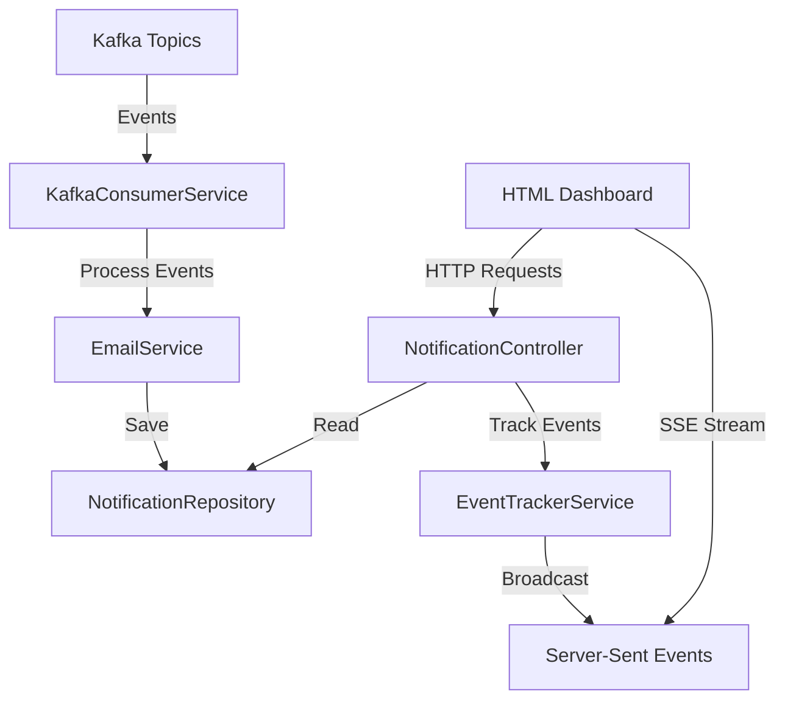

# Notification Service Monitoring UI

## Overview

Create a comprehensive monitoring dashboard for the notification service that displays Kafka events in real-time, notification history, statistics, and provides testing capabilities.

## Architecture

## Implementation Plan

### 1. Create DTOs for API Responses

**File**: `services/notification/src/main/java/com/example/notification/dto/NotificationResponseDto.java`

- Fields: id, email, subject, message, status, sentAt, userId

**File**: `services/notification/src/main/java/com/example/notification/dto/NotificationStatsDto.java`

- Fields: totalNotifications, sentCount, failedCount, pendingCount, successRate

**File**: `services/notification/src/main/java/com/example/notification/dto/KafkaEventDto.java`

- Fields: eventType, eventData, timestamp, topic, processed

**File**: `services/notification/src/main/java/com/example/notification/dto/KafkaStatusDto.java`

- Fields: isConnected, consumerGroup, topics, lastEventTime

**File**: `services/notification/src/main/java/com/example/notification/dto/TestNotificationRequestDto.java`

- Fields: email, subject, message

### 2. Create Event Tracker Service

**File**: `services/notification/src/main/java/com/example/notification/service/EventTrackerService.java`

- In-memory storage of recent Kafka events (last 100 events)
- Methods to add events, get recent events, clear events
- Thread-safe implementation using ConcurrentLinkedQueue

### 3. Update Kafka Consumer Service

**File**: `services/notification/src/main/java/com/example/notification/service/KafkaConsumerService.java`

- Inject EventTrackerService
- Track events when consuming from Kafka
- Store event metadata (timestamp, topic, event type)

### 4. Create REST Controller

**File**: `services/notification/src/main/java/com/example/notification/controller/NotificationController.java`

- `GET /api/v1/notifications` - List all notifications (paginated)
- `GET /api/v1/notifications/stats` - Get statistics
- `GET /api/v1/notifications/kafka/status` - Get Kafka consumer status
- `GET /api/v1/notifications/kafka/events` - Get recent Kafka events
- `GET /api/v1/notifications/events/stream` - SSE endpoint for real-time events
- `POST /api/v1/notifications/test` - Test sending a notification
- `GET /api/v1/notifications/dashboard` - Serve the HTML dashboard page

### 5. Create HTML Dashboard

**File**: `services/notification/src/main/resources/static/notification-dashboard.html`

- Modern, responsive UI with sections for:
- Real-time Kafka events feed (auto-updating via SSE)
- Notifications list table (with status badges)
- Statistics cards (total, success rate, failure rate)
- Kafka consumer status indicator
- Test notification form
- Use vanilla JavaScript with Fetch API and EventSource for SSE
- Auto-refresh every 5 seconds for non-SSE data
- Color-coded status indicators (green=SENT, yellow=PENDING, red=FAILED)

### 6. Update Notification Model

**File**: `services/notification/src/main/java/com/example/notification/model/Notification.java`

- Ensure userId field is properly handled (may need to be nullable or have default)

### 7. Update Repository

**File**: `services/notification/src/main/java/com/example/notification/repository/NotificationRepository.java`

- Add method: `findAllByOrderBySentAtDesc(Pageable pageable)`
- Add method: `countByStatus(NotificationStatus status)`

## Key Features

1. **Real-time Event Monitoring**: Server-Sent Events (SSE) stream showing Kafka events as they're consumed
2. **Notification History**: Paginated list of all notifications with filtering by status
3. **Statistics Dashboard**: Real-time metrics showing total notifications, success/failure rates
4. **Kafka Health**: Display consumer group status, connected topics, last event timestamp
5. **Test Functionality**: Form to manually trigger test notifications

## Technical Details

- Use Spring's `SseEmitter` for Server-Sent Events
- Store last 100 Kafka events in memory (EventTrackerService)
- Pagination for notifications list (20 per page)
- Thread-safe event tracking using concurrent collections
- RESTful API following existing service patterns

## Access

After deployment, the dashboard will be accessible at:

- `http://localhost:10050/api/v1/notifications/dashboard`